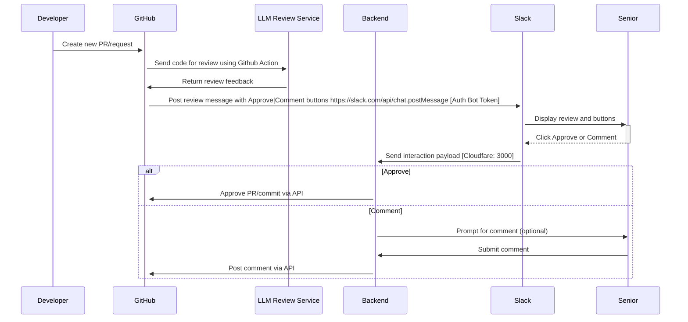

# System Architect

```mermaid
sequenceDiagram
    participant Dev as Developer
    participant GH as GitHub
    participant LLM as LLM Review Service
    participant BE as Backend
    participant Slack as Slack
    

    Dev->>+GH: Create new PR/request
    GH->>+LLM: Send code for review using Github Action
    LLM->>+GH: Return review feedback
    GH->>+Slack: Post review message with Approve|Comment buttons https://slack.com/api/chat.postMessage [Auth Bot Token]
    Slack->>+Senior: Display review and buttons
    Senior-->>-Slack: Click Approve or Comment
    Slack->>+BE: Send interaction payload [Cloudfare: 3000]
    alt Approve
        BE->>GH: Approve PR/commit via API
    else Comment
        BE->>Senior: Prompt for comment (optional)
        Senior->>BE: Submit comment
        BE->>GH: Post comment via API
    end
```